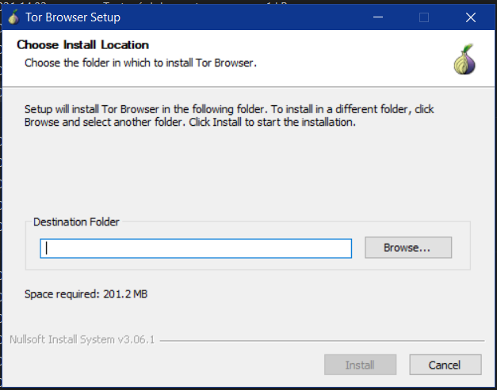
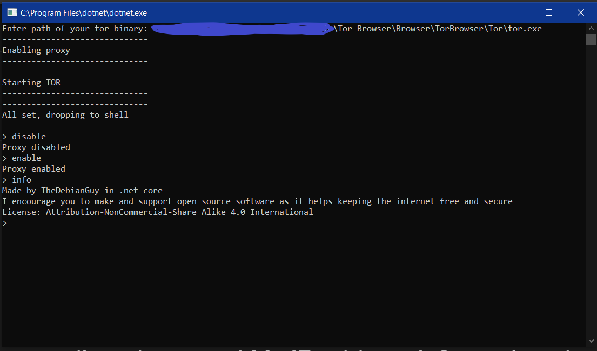

## TorShield ~ Menu
[Installation](#installation) 
[How does it work](#knowhow) 
[Useful links](#links) 
 
<b name="installation">How to install</b> 
<a href='https://www.torproject.org/download/'>[1] Download TOR browser</a>

[2] Specify the tor binary path to TorShield

[3] Let your IP address be changed

 

The script basically changes global proxy settings and enviroment variables using system commands and eventually api calls. Theres a known issue that windows socks routing may not work due to unknown reasons, however it may work on your machine. You can check if socks settings work using the command `curl ifconfig.me` which returns your IP address.

 
<pre name="links">
<a href='https://tb-manual.torproject.org'>TOR browser manual</a>
<a href='https://github.com/torproject/tor/blob/master/LICENSE'>TOR project license</a>
<a href='https://www.avg.com/en/signal/proxy-server-definition'>How proxy works</a>
</pre>
